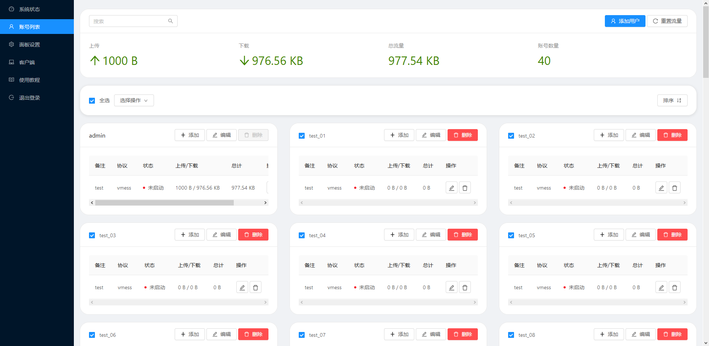
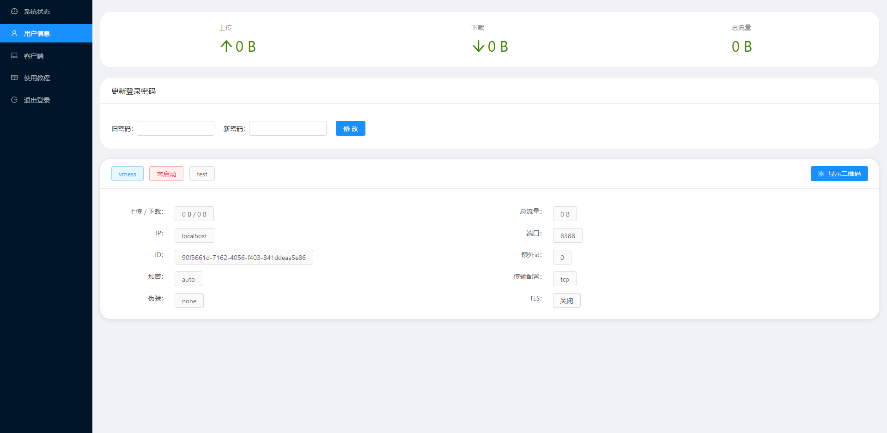

# Owner: Dự án gốc nằm ở đây [**Nick-Hopps**](https://github.com/Nick-Hopps/v2-ui-plus) tôi chỉ phát triển lại nó

# V2 X-UI Unofficial
```
Đây Là Phiên Bản X-UI được Việt Hoá và cập nhật Xray định kỳ.
```

# Lưu ý

Đây là phiên bản nâng cao của phiên bản gốc của tác giả [v2-ui] (https://github.com/sprov065/v2-ui), thêm chức năng quản lý tài khoản, đa người dùng một cổng và các chức năng khác, cùng nhiều chức năng khác. vẫn đang trong giai đoạn phát triển thứ cấp.

Ngoài ra, tập lệnh `install.sh` trong dự án hiện tại vẫn chưa được thay đổi, vì vậy, bạn nên sử dụng` python v2-ui.py` để chạy dự án này tạm thời. Đồng thời do vẫn đang trong quá trình phát triển nên chưa có kế hoạch sản xuất phiên bản biên dịch tĩnh, bạn có thể tự biên dịch nếu cần.

# chức năng đã hoàn thành

- `Fix` để sửa các lỗi hiện có và tối ưu hóa một số chức năng;
- `Thêm` Thêm chức năng quản lý tài khoản
  - Bạn có thể thêm người dùng thông thường và người dùng quản trị viên, người dùng đầu tiên mặc định là người dùng quản trị viên và không thể bị xóa;
  - Nhiều tài khoản có thể được kích hoạt / hủy kích hoạt / xóa hàng loạt và có thể được sắp xếp theo cách tạo / tên người dùng / lưu lượng truy cập theo thứ tự tăng dần và giảm dần;
  - Mỗi người dùng có thể thêm nhiều cấu hình gửi đến một cách độc lập và mỗi cấu hình gửi đến có thể đếm lưu lượng truy cập riêng biệt.
- `Tính năng` bây giờ có thể thêm cấu hình của cùng một cổng và tự động hợp nhất cấu hình của cùng một cổng với cùng một giao thức trước khi ghi tệp cấu hình;
- `Tối ưu hóa` Sửa đổi phương pháp thống kê lưu lượng thành" email ", thuận tiện để đếm độc lập lưu lượng của từng cấu hình gửi đến sau khi cấu hình được hợp nhất;
- `Thêm` thêm Dockerfile, bạn có thể sử dụng dự án này trong Docker sau khi tự biên dịch;
- `Mới` Đã thêm mục cài đặt" cổng bên ngoài v2ray "để hiển thị cổng bên ngoài của proxy Haproxy hoặc Nginx để tạo liên kết cấu hình chính xác / mã QR;
- `Mới` Đã thêm mục cài đặt" v2ray External TLS "để hiển thị trạng thái TLS của proxy Haproxy hoặc Nginx để tạo liên kết cấu hình chính xác / mã QR;
- Chức năng nhật ký sửa chữa `sửa chữa`, giờ đây các bản ghi có thể được xuất thành công sang các tệp stdout và log;
- Mục cài đặt `mới` Đã thêm" Sử dụng Xray-Core ", có thể thay thế Core bằng Xray-Core và thêm hỗ trợ dự phòng;
- `Mới` để sử dụng trình trang trí để triển khai chức năng xác thực một cách đơn giản;
- `Sửa chữa` sắp xếp" theo tạo "bây giờ hoạt động chính xác.

# Tính năng đang được phát triển

Không

# Bổ sung theo kế hoạch

- Các máy chủ HTTP như Nginx / Caddy có thể được sử dụng thay cho Tornado;

# vấn đề hiện đang tồn tại

- Cấu hình giao diện người dùng chưa hoàn tất.

# giao diện hiển thị




